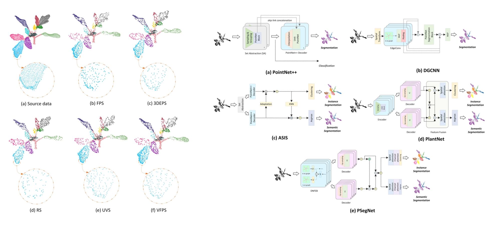

# A-comparative-study-on-point-cloud-down-sampling-strategies-for-deep-learning-based-crop-organ-segmentation
This repo contains the official codes for our paper:

### **A comparative study on point cloud down-sampling strategies for deep learning-based crop organ segmentation**

[Dawei Li](https://davidleepp.github.io/),  [Yongchang Wei](https://github.com/WeiyongchangChina), and Rongsheng Zhu

Published on *Plant Methods* in 2023

[[Paper](https://link.springer.com/article/10.1186/s13007-023-01099-7)]

___

## Prerequisites
- The project was deployed on a not-so-new computing platform that has a 16-core AMD Ryzen CPU and 3 paralleled Nvidia RTX2080Ti Grapic cards. This also explains why we chose TensorFlow rather than Pytorch. On realizing PlantNet and PSegNet For a more modern version  that used PyTorch please refer to another repo of our lab at https://github.com/Huang2002200/PlantNet-and-PSegNet.
- Python == 3.7.13
- Numpy == 1.21.5
- tensorflow == 1.13.1
- CUDA == 11.7
- cuDNN == 10.1
- PCL == 1.120
- All deep networks run under Ubuntu 20.04


## Abstract

The 3D crop data obtained during cultivation is of great signifcance to screening excellent varieties in modern breeding and improvement on crop yield. With the rapid development of deep learning, researchers have been making  innovations in aspects of both data preparation and deep network design for segmenting plant organs from 3D  data. 

Training of the deep learning network requires the input point cloud to have a fxed scale, which means all  point clouds in the batch should have similar scale and contain the same number of points. A good down-sampling  strategy can reduce the impact of noise and meanwhile preserve the most important 3D spatial structures. As far  as we know, this work is the frst comprehensive study of the relationship between multiple down-sampling strategies and the performances of popular networks for plant point clouds. 

Five down-sampling strategies (including  FPS, RS, UVS, VFPS, and 3DEPS) are cross evaluated on fve diferent segmentation networks (including PointNet+ +,  DGCNN, PlantNet, ASIS, and PSegNet). The overall experimental results show that currently there is no strict golden  rule on fxing down-sampling strategy for a specifc mainstream crop deep learning network, and the optimal downsampling strategy may vary on diferent networks. However, some general experience for choosing an appropriate  sampling method for a specifc network can still be summarized from the qualitative and quantitative experiments. 

 First, 3DEPS and UVS are easy to generate better results on semantic segmentation networks. Second, the voxel-based  down-sampling strategies may be more suitable for complex dual-function networks. Third, at 4096-point resolution,  3DEPS usually has only a small margin compared with the best down-sampling strategy at most cases, which means  3DEPS may be the most stable strategy across all compared. This study not only helps to further improve the accuracy  of point cloud deep learning networks for crop organ segmentation, but also gives clue to the alignment of downsampling strategies and a specifc network



## File Structure

```
Abstract  
├─data-example  
│  ├─3DEPS_ratio=0.20  
│  └─raw-data  
├─deep-learning-network  
│  ├─ASIS  
│  │  ├─data  
│  │  ├─models  
│  │  ├─log  
│  │  │  ├─test  
│  │  │  └─train  
│  │  ├─tf_ops  
│  │  │  ├─3d_interpolation  
│  │  │  ├─grouping  
│  │  │  └─sampling  
│  │  └─utils  
│  ├─DGCNN  
│  │  ├─data  
│  │  ├─models  
│  │  ├─part_seg  
│  │  │  ├─log  
│  │  │  │  ├─test  
│  │  │  │  └─train  
│  │  ├─tf_ops  
│  │  │  ├─3d_interpolation  
│  │  │  ├─grouping  
│  │  │  │  ├─test  
│  │  │  └─sampling  
│  │  └─utils  
│  ├─PlantNet  
│  │  ├─data  
│  │  ├─models  
│  │  │  ├─log_test  
│  │  │  │  ├─test  
│  │  │  │  └─train  
│  │  ├─tf_ops  
│  │  │  ├─3d_interpolation  
│  │  │  ├─grouping  
│  │  │  │  ├─test  
│  │  │  └─sampling  
│  │  └─utils  
│  ├─PointNet++  
│  │  ├─data  
│  │  ├─models  
│  │  ├─part_seg  
│  │  ├─tf_ops  
│  │  │  ├─3d_interpolation  
│  │  │  ├─grouping  
│  │  │  │  ├─test  
│  │  │  └─sampling  
│  │  └─utils  
│  └─PSegNet  
│      ├─data  
│      ├─models  
│      │  ├─log_test  
│      │  │  ├─test  
│      │  │  └─train  
│      ├─tf_ops  
│      │  ├─3d_interpolation  
│      │  ├─grouping  
│      │  │  ├─test  
│      │  └─sampling  
│      └─utils  
├─docs  
└─down-sampling-strategies  
    ├─3DEPS  
    ├─dataset-creation-process  
    ├─FPS  
    ├─RS  
    ├─UVS  
    └─VFPS   
```

## Down-Sampling Code 

The downsampling strategies in the open-source code are presented in the folder [down-sampling-strategies].

They are Farthest Point Sampling (FPS), 3D Edge-preserving Sampling (3DEPS), Random Sampling (RS), Voxelized Farthest Point Sampling (VFPS), and Uniformly Voxelized Sampling (UVS).

### 1. FPS

Farthest Point Sampling (FPS) is a simple and frequently used downsampling strategy.

- The file `FPS_Batch.py` is the entry codes for point set down-sampling.

### 2. 3DEPS

3D Edge‑Preserving Sampling (3DEPS) is a downsampling strategy that draw inspiration from how a human do sketching. The principle of the strategy can be referred to: [[Paper](https://www.sciencedirect.com/science/article/pii/S0924271622000119)]
3DEPS runs with the following steps:
- The file `001批量保存植物边缘和中心部位(c++).cpp` is used to separate plant point clouds into edge points and non-edge points (in batches), respectively.
- The file `002将边缘部分和非边缘部分合并到4096+4096.py` is used to merge the edge part and the non-edge part into a "4096+4096" manner.
- The file `003按比例合并成一个新点云同时进行10倍扩充.py` works on the "4096+4096" result of file002, and merges the two parts with a ratio to form a new point cloud. When merging, the FPS automatically carries out 10 times data augmentation.

**Notice! Programs need to be run one by one in the order of name and number.**

**file001 runs under PCL (Point Cloud Library).**

### 3. RS

Random sampling (RS) is a random sampling strategy that works sequentially using functions from the PCL library.

- The file `RandomSample.cpp` is the entry code for RS down-sampling.

### 4. VFPS

Voxelized Farthest Point Sampling (VFPS) is a downsampling strategy based on voxelization. The VFPS strategy was also used in PSegNet as the main 3D data preprocessing technique, the details can be referred to [[Paper](https://spj.science.org/doi/full/10.34133/2022/9787643?adobe_mc=MCMID%3D14000805405683999525849378418609464876%7CMCORGID%3D242B6472541199F70A4C98A6%2540AdobeOrg%7CTS%3D1700524800)]

- The file `001Voxel_filter.cpp` is used to voxelize and simplify the point cloud.
- The file `002FPS_Batch.py` is the following FPS step, which strictly fixes the number of points after step001 and automatically conducts data augmentation.

**Notice! Programs need to be run one by one in the order of name and number.**

**001 runs under PCL (Point Cloud Library).**

### 5. UVS

Uniformly Voxelized Sampling (UVS) is another downsampling strategy based on voxelization (quite similar to VFPS).

- The file `001uniformSampling.cpp` is used to voxelize and simplify the point cloud.
- The file `002FPS_Batch.py` is the following FPS step, which strictly fixes the number of points after step001 and automatically conducts data augmentation.

**Notice! Programs need to be run one by one in order of name and number.**

**001 runs under PCL (Point Cloud Library).**

### 6. dataset-creation-process (how we prepare training and testing point cloud data for deep networks)

All the above codes (from 1. FPS to 5. UVS ) are not the complete downsampling process, each above sampling strategy should work as the file 005 in the following pipeline. The  [down-sampling-strategies/dataset-creation-process] folder is the complete process of downsampling processing, and the pipeline is specified as follows.

- The file `000批量修改label格式(python).py` is used to modify label formats from input batches; different data labels usually represents different plant organs.
- The file `001PCD2TXT(python).py` is used to convert files from PCD format to the txt format, which can also be skipped when the input is already in txt format.
- The file `002去除背景点和噪点.py` is used to remove background points and noise from the original plant point clouds.
- The file `003去除在原点的点.py` is used to remove points at the origin.
- The file `004添加object标签类别减2.py` is used to remove background points and noise points from the dataset.
- The file `005各种降采样策略.txt` is only a "dummy" file, this step should be substitued with any of FPS, 3DEPS, RS, VFPS, or UVS code. After this step, each point cloud is also augmented (default 10x) to diversify training data.
- The file `006分测试集和训练集.py` is used to divide the augmented point cloud data into a training set and a test set.
- The file `007将txt转换成H5(python).py` is used to convert point clouds in txt into data format in h5 files. The h5 files are then used to training the deep networks programed with TensorFlow.

**Notice! Programs need to be run one by one in the order of name and number.**

## Deep Networks for 3D Plant Organ Segmentation

The Deep Networks in the open-source code are saved in folder [deep-learning-network].

The folder contains ASIS, DGCNN, PlantNet, PSegNet, and PointNet++.

We kept a well-trained model (by ourselves) in the log file in the project file of each network for testing only.

We also provided code in TensorFlow for all five deep networks.

The dataset that can run on each network was saved in the data folder.

## Datasets

We saved an example dataset in the [data-example] folder.

It contains a well-prepared h5 data set using 3DEPS_ratio=0.20, divided into a training set and a test set.
It also contains the raw three-species crop data set that is first used in PlantNet [[Paper](https://www.sciencedirect.com/science/article/pii/S0924271622000119)].

## Citation
Please consider citing our papers if you find the project helps your research :
```
[1] D. Li, Y. Wei, and R. Zhu, “A comparative study on point cloud down-sampling strategies for deep learning-based crop organ segmentation,” Plant Methods, vol. 19, Article No. 124, 2023. Published: 11 November 2023. https://doi.org/10.1186/s13007-023-01099-7.
[2] D. Li†, G. Shi†, J. Li, Y. Chen, S. Zhang, S. Xiang, and S. Jin, “PlantNet: A dual-function point cloud segmentation network for multiple plant species”, ISPRS Journal of Photogrammetry and Remote Sensing, vol. 184, 2022, pp. 243-263. DOI: 10.1016/j.isprsjprs.2022.01.007. (†Contributed equally)
```
